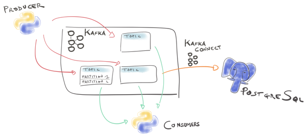
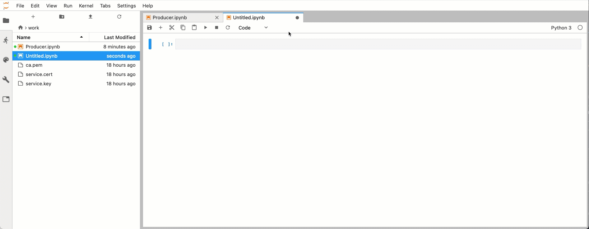
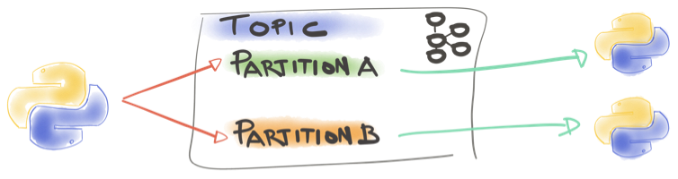
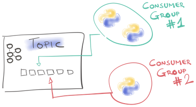

# Python Jupyter Notebooks for Apache Kafka®

This is a series of Jupyter Notebooks on how to start with Apache Kafka® and Python.
You can try these notebooks in order to learn the basic concepts of Apache Kafka in an environment containing markdown text, media and executable code on the same page.

The notebooks are based on a managed Apache Kafka instance created on [Aiven's website](https://aiven.io/kafka?utm_source=github&utm_medium=organic&utm_campaign=blog_art&utm_content=repo), but can be also customised to any Apache Kafka instance running locally with SSL authentication. Aiven's offer 300$ of free credit that you can redeem by creating your account on [Aiven's website](https://console.aiven.io/signup?utm_source=github&utm_medium=organic&utm_campaign=blog_art&utm_content=repo).

If you have any question or improvement suggestion regarding the notebooks, please open an issue. Any contributions are welcome!


## Start JupyterLab on Docker

You can access the notebooks via Jupyterlab, this example will be based on docker

1. clone the repository
2. open a terminal
3. go to the folder where the repository has been cloned
4. run the following

```
docker run --rm -p 8888:8888 \
  -e JUPYTER_ENABLE_LAB=yes  \
  -v "$PWD":/home/jovyan/work \
  jupyter/datascience-notebook
```

You'll see a folder named `work` on the top left, under it you'll find the list of notebooks.

## Notebook Overview

This repository contains the following notebooks.

* [00 - Aiven Setup.ipynb](00%20-%20Aiven%20Setup.ipynb): Creates requires Apache Kafka and PostgreSQL instances on Aiven website
* [01 - Producer.ipynb](01%20-%20Producer.ipynb): Creates a Python Producers and produces the first messages
* [02 - Consumer.ipynb](02%20-%20Consumer.ipynb): reads the messages produced by [01 - Producer.ipynb](01%20-%20Producer.ipynb)
* [03 - 00 - Partition Producer.ipynb](03%20-%2000%20-%20Partition%20Producer.ipynb): creates a topic with two partitions and pushes records in each partition
* [03 - 01 - Consumer - Partition 0.ipynb](03%20-%2001%20-%20Consumer%20-%20Partition%200.ipynb): reads messages pushed by [03 - 00 - Partition Producer.ipynb](03%20-%2000%20-%20Partition%20Producer.ipynb) on partition 0
* [03 - 02 - Consumer - Partition 1.ipynb](03%20-%2001%20-%20Consumer%20-%20Partition%200.ipynb): reads messages pushed by [03 - 00 - Partition Producer.ipynb](03%20-%2000%20-%20Partition%20Producer.ipynb) on partition 1
* [04 - New Consumer Group.ipynb](04%20-%20New%20Consumer%20Group.ipynb): creates a new consumer part of a new consumer group and reads messages produced by [01 - Producer.ipynb](01%20-%20Producer.ipynb)
* [05 - Kafka Connect.ipynb](05%20-%20Kafka%20Connect.ipynb): creates a new topic containing JSON messages with schema and payload, and then creates a Kafka Connect JDBC Connector to PostgreSQL
* [ON - Aiven - Delete Services.ipynb](0N%20-%20Aiven%20-%20Delete%20Services.ipynb): deletes all the instances created by [00 - Aiven Setup.ipynb](00%20-%20Aiven%20Setup.ipynb)

## Notebook Details

The notebooks are divided per Apache Kafka functionality.

### Create Managed Apache Kafka and PostgreSQL instances with [Aiven.io](https://console.aiven.io/signup?utm_source=github&utm_medium=organic&utm_campaign=blog_art&utm_content=repo)



**00 - Aiven Setup.ipynb** notebook downloads [Aiven's command line interface](https://aiven.io/blog/command-line-magic-with-the-aiven-cli?utm_source=github&utm_medium=organic&utm_campaign=blog_art&utm_content=repo) and creates an Apache Kafka and a PostgreSQL instance.

Please change `<INSERT_TOKEN_HERE>` and `<INSERT_EMAIL_HERE>` with a valid email address and token created on [Aiven's website](https://console.aiven.io/signup?utm_source=github&utm_medium=organic&utm_campaign=blog_art&utm_content=repo). The notebook creates the instances and also stores all the required connection credentials locally.

### Produce and read Messages to Apache Kafka


**01 - Producer.ipynb** Creates a Python Apache Kafka Producer and produces the first messages. After the first message is produced, open  the **02 - Consumer.ipynb** notebook and pace it alongside the Producer.



**02 - Consumer.ipynb** reads from the topic where **01 - Producer** wrote. But it does it from the point in time that it attaches to Apache Kafka, not going back to history.


If you want to read messages created with **01 - Producer** you need to run **02 - Consumer.ipynb**'s last code block before producing any messages on **01 - Producer**. This behaviour is Apache Kafka's default and can be changed by adding a line `'auto.offset.reset'='earliest'` to the consumer properties.

### Understanding Apache Kafka Partitions



Partitions is Apache Kafka are a way to divide messages belonging to the same topic in sub-logs.
* **03 - 00 - Partition Producer.ipynb** creates a topic with two partitions using `KafkaAdmin` and sends a message to each partition.
We can then open both **03 - 01 - Consumer - Partition 0.ipynb** and **03 - 02 - Consumer - Partition 1.ipynb** which will read messages from `Partition 0` and `Partition 1` respectively.

### New Consumer Group



Messages in Apache Kafka are not deleted when read from a consumer. This makes them available for other consumers to be read. **04 - New Consumer Group.ipynb** creates a new consumer part of the a new Consumer Group and reads from the topic where **01 - Producer** wrote. We can check now, by sending a message from the **01 - Producer** notebook, that we can receive it both in **02 - Consumer.ipynb** and **04 - New Consumer Group**.

### Kafka Connect


Apache Kafka Connect® is a prebuilt framework enabling an easy integration of Apache Kafka with existing data sources or sinks. Aiven provides [Kafka connect as managed service](https://aiven.io/kafka-connect?utm_source=github&utm_medium=organic&utm_campaign=blog_art&utm_content=repo) making the integration a matter of a single config file. **05 - Kafka Connect.ipynb**: Creates a new Kafka topic containing messages with both schema and payload, and then pushes them to a PostgreSQL database via Apache Kafka Connect.

### Delete Aiven Services


Once you're done, you can delete all the services create on [Aiven's website](https://console.aiven.io/signup?utm_source=github&utm_medium=organic&utm_campaign=blog_art&utm_content=repo) by executing the code in **ON - Aiven - Delete Services.ipynb**

# Keep Reading

We maintain some other resources that you may also find useful:

* [Command Line Magic with avn](https://aiven.io/blog/command-line-magic-with-the-aiven-cli?utm_source=github&utm_medium=organic&utm_campaign=blog_art&utm_content=repo)
* [Teach Yourself Apache Kafka with Jupyter Notebooks](#)

# License
This project is licensed under the [Apache License, Version 2.0](https://github.com/aiven/aiven-kafka-connect-s3/blob/master/LICENSE).

Apache Kafka is either a registered trademark or trademark of the Apache Software Foundation in the United States and/or other countries. Aiven has no affiliation with and is not endorsed by The Apache Software Foundation.
